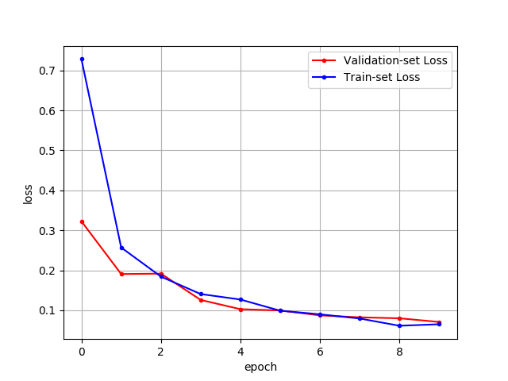
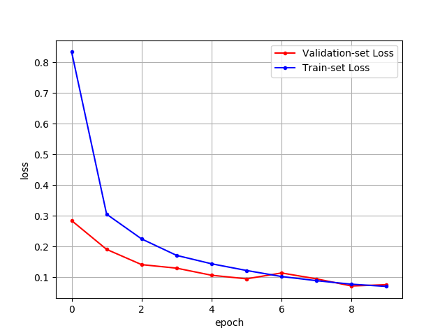
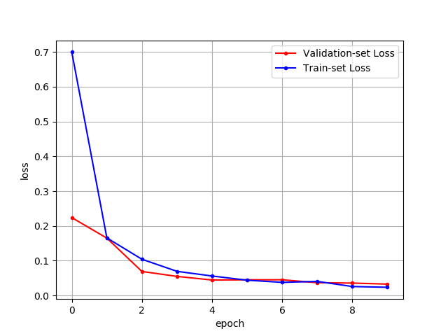

# keras_mnist_test_models
Test CNN model and simple FC model with keras

## Fully connected network with MNIST data set
### FC without dropout
```
_________________________________________________________________
Layer (type)                 Output Shape              Param #   
=================================================================
dense_1 (Dense)              (None, 256)               200960    
_________________________________________________________________
dense_2 (Dense)              (None, 512)               131584    
_________________________________________________________________
dense_3 (Dense)              (None, 128)               65664     
_________________________________________________________________
dense_4 (Dense)              (None, 10)                1290      
=================================================================
Total params: 399,498
Trainable params: 399,498
Non-trainable params: 0
_________________________________________________________________
```

#### Test loss (with 30 custom image)
```
Test loss: 2.097367763519287
Test accuracy: 0.36666667461395264
```
### FC with dropout
```
_________________________________________________________________
Layer (type)                 Output Shape              Param #   
=================================================================
dense_5 (Dense)              (None, 256)               200960    
_________________________________________________________________
dense_6 (Dense)              (None, 512)               131584    
_________________________________________________________________
dropout_1 (Dropout)          (None, 512)               0         
_________________________________________________________________
dense_7 (Dense)              (None, 128)               65664     
_________________________________________________________________
dropout_2 (Dropout)          (None, 128)               0         
_________________________________________________________________
dense_8 (Dense)              (None, 10)                1290      
=================================================================
Total params: 399,498
Trainable params: 399,498
Non-trainable params: 0
_________________________________________________________________
```

#### Test loss (with 30 custom image)
```
Test loss: 2.1885976791381836
Test accuracy: 0.36666667461395264
```
## CNN with MNIST data set
### CNN without dropout
```
_________________________________________________________________
Layer (type)                 Output Shape              Param #   
=================================================================
conv2d_1 (Conv2D)            (None, 26, 26, 32)        320       
_________________________________________________________________
conv2d_2 (Conv2D)            (None, 24, 24, 64)        18496     
_________________________________________________________________
max_pooling2d_1 (MaxPooling2 (None, 12, 12, 64)        0         
_________________________________________________________________
flatten_1 (Flatten)          (None, 9216)              0         
_________________________________________________________________
dense_9 (Dense)              (None, 128)               1179776   
_________________________________________________________________
dense_10 (Dense)             (None, 10)                1290      
=================================================================
Total params: 1,199,882
Trainable params: 1,199,882
Non-trainable params: 0
_________________________________________________________________
```

#### Test loss (with 30 custom image)
```
Test loss: 1.5110989809036255
Test accuracy: 0.6000000238418579
```
### CNN with dropout
```

_________________________________________________________________
Layer (type)                 Output Shape              Param #   
=================================================================
conv2d_3 (Conv2D)            (None, 26, 26, 32)        320       
_________________________________________________________________
conv2d_4 (Conv2D)            (None, 24, 24, 64)        18496     
_________________________________________________________________
max_pooling2d_2 (MaxPooling2 (None, 12, 12, 64)        0         
_________________________________________________________________
dropout_3 (Dropout)          (None, 12, 12, 64)        0         
_________________________________________________________________
flatten_2 (Flatten)          (None, 9216)              0         
_________________________________________________________________
dense_11 (Dense)             (None, 128)               1179776   
_________________________________________________________________
dropout_4 (Dropout)          (None, 128)               0         
_________________________________________________________________
dense_12 (Dense)             (None, 10)                1290      
=================================================================
Total params: 1,199,882
Trainable params: 1,199,882
Non-trainable params: 0
_________________________________________________________________
```

#### Test loss (with 30 custom image)
```
Test loss: 0.859388530254364
Test accuracy: 0.6666666865348816
```
